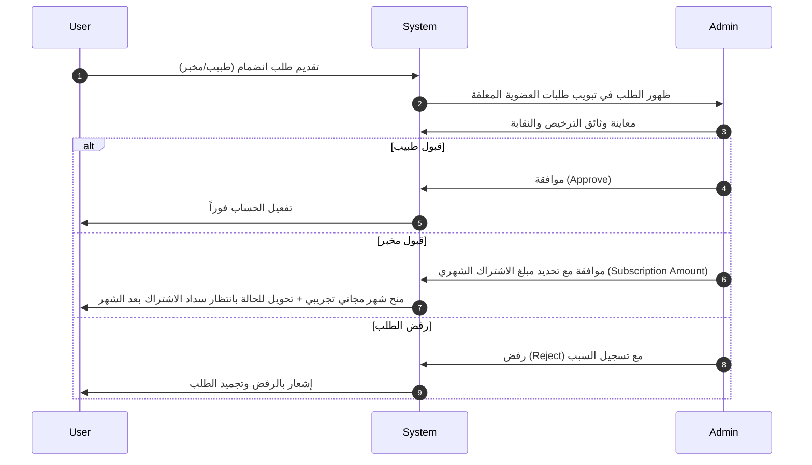
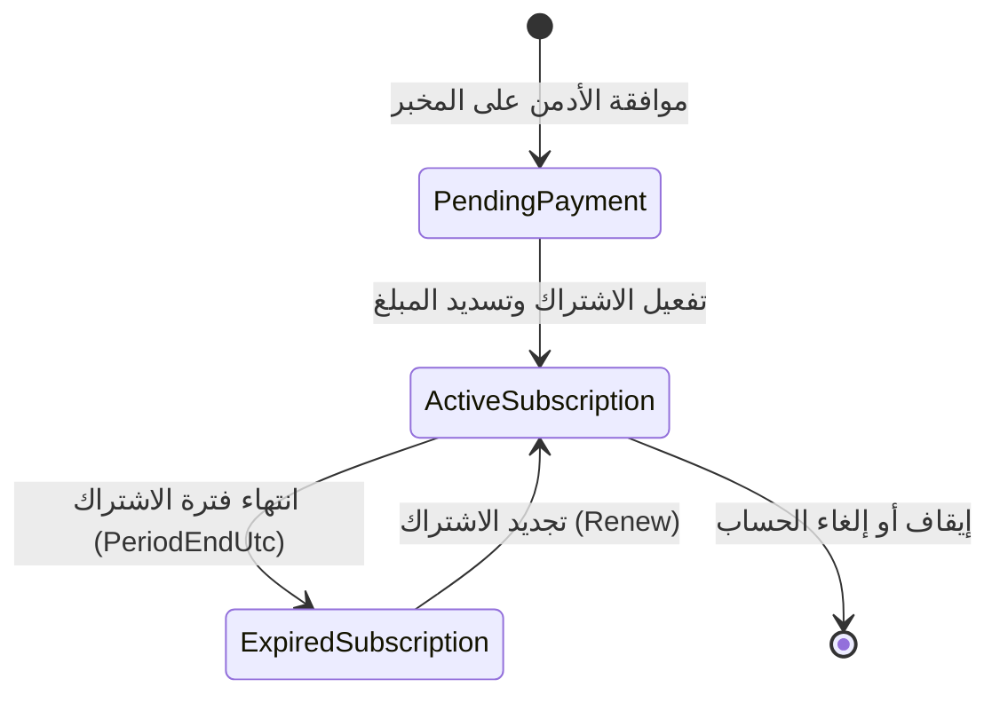

# الدليل الشامل لسيناريوهات وتدفقات عمل الأدمن وخدمات لوحة التحكم 2026 🦷📊
### Dental Dashboard 2026 - Comprehensive Admin Scenarios & Services Guide

---

## 📌 مقدمة وهدف الدليل

تُعد لوحة التحكم الإدارية **Dental Dashboard 2026** المركز الرئيسي لإدارة وتنظيم منظومة التعويضات السنية والخدمات الرقمية بين **أطباء الأسنان (Dentists)**، **المخابر السنية (Dental Labs)**، **فنيي المخابر (Lab Technicians)**، و**المُعلنين والموردين (Ad Clients)**.

يقدم هذا الدليل توثيقاً كاملاً وتفصيلياً لجميع **السيناريوهات التشغيلية (Use Cases & Workflows)**، **الحالات الاحتياطية والعادية (Normal & Edge Cases)**، و**كافة الخدمات (Services & API Endpoints)** التي يقدمها الأدمن عبر هذه اللوحة دون إغفال أي تفصيل أو فكرة.

---

## 🗺️ خريطة الخدمات والإمكانات الرئيسية للأدمن (Ecosystem Overview)

```mermaid
graph TD
    Admin((الأدمن Admin)) --> Auth[1. تسجيل الدخول والأمان]
    Admin --> Overview[2. لوحة المؤشرات الإحصائية KPIs]
    Admin --> Membership[3. إدارة طلبات النقابة والعضوية]
    Admin --> Dentists[4. إدارة الأطباء]
    Admin --> Labs[5. إدارة المخابر والفنيين]
    Admin --> Subscriptions[6. دورة حياة الاشتراكات المالية]
    Admin --> CaseOrders[7. متابعة الحالات والملفات الرقمية 3D]
    Admin --> Ads[8. المحرك الإعلاني والعملاء]
    Admin --> Blogs[9. الرقابة على المدونات الطبية]
    Admin --> Notifications[10. مركز الإشعارات والبث المباشر]
    Admin --> Invoices[11. إدارة الفواتير والمتحصلات]
    Admin --> Interventions[12. التدخلات والدعم وفض النزاعات]
    Admin --> Reports[13. التقارير التجميعية والمالية]
```

---

## 🎬 1. سيناريو تسجيل الدخول، الأمان وتخصيص البيئة (Auth & Environment Scenario)

### 🔹 1.1 التدفق الطبيعي (Happy Path)
1. **دخول النظام:** يتوجه الأدمن إلى المسار `/login`.
2. **إدخال البيانات:** يطالب النظام باسم المستخدم/البريد الإلكتروني وكلمة المرور.
3. **خيار "تذكرني":** تفعيل خيار الحفاظ على الجلسة.
4. **التحقق والتوجيه:** يرسل النظام الطلب للباك إند، ويتم تخزين رمز الأمان `auth_token` في الـ Cookies ثم التوجيه التلقائي إلى الصفحة الرئيسية للوحة التحكم `/dashboard`.

### 🔹 1.2 الحالات الاستثنائية والاحتياطية (Edge Cases & Validations)
* **بيانات غير صحيحة:** إظهار رسالة تنبيه حمراء (Sonner Toast) توضح الخطأ في كلمة المرور أو اسم المستخدم دون تسريب بيانات حساسة.
* **الجلسة المنتهية أو محاولة الوصول المباشر:** يمنع الـ `ProtectedRoute` الوصول لأي صفحة داخلية وتتم إعادة التوجيه الفوري لصفحة تسجيل الدخول `/login`.
* **تغيير ثيم الواجهة (Dark/Light Mode):** تتيح اللوحة للأدمن التبديل السلس بين الوضع الليلي والنهاري عبر زر عائم `ThemeToggleFAB` مع دعم كامل للغة العربية والاتجاه من اليمين إلى اليسار (`RTL`).

---

## 📊 2. سيناريو لوحة المؤشرات الرئيسية والتحليلات الحية (Dashboard & Live KPIs)

تعتبر هذه الصفحة مركز القيادة اليومي للأدمن لمراقبة نبض المنصة.

### 🔹 2.1 البطاقات الإحصائية الأربعة (KPI Cards Scenario)
1. **إحصائيات الأطباء (Total Doctors):**
   * **إجمالي الأطباء:** المسجلين في المنصة (`/Users/dentists`).
   * **الأطباء النشطين:** الذين يملكون حالة `status === 1` أو `approved`.
   * **الطلبات المعلقة:** الطلبات في انتظار موافقة النقابة (`/AdminAccounts/dentists/pending-approval`).
2. **إحصائيات المخابر (Total Labs):**
   * **إجمالي المخابر:** المسجلة في النظام (`/Labs`).
   * **المخابر المشتركة نشطاً:** التي يملك حسابها اشتراكاً سارياً (`/LabSubscription/active-subscribed-labs`).
   * **المخابر الموقوفة/المنتهية:** التي انتهت فترة اشتراكها أو تم إيقافها.
3. **إحصائيات الحالات النشطة (Active Cases):**
   * **الحالات قيد التنفيذ:** تجميع الطلبات ذات الحالات التشغيلية غير المنتهية (`/CaseOrders/all-with-details`).
   * **متابعة مراحل الإنتاج:** (قيد التصميم، قيد التلوين، جاهزة، أو بانتظار مسح الأبعاد Scanner).
4. **الإيرادات المالية الشهرية (Monthly Revenue):**
   * **أرباح الاشتراكات:** مجموع القيم المحصلة من تفعيل وتجديد اشتراكات المخابر.
   * **أرباح الإعلانات:** مجموع القيم المحصلة من تفعيل نشر الإعلانات.

### 🔹 2.2 الرسومات والمخططات البيانية (Dynamic Analytics Charts)
* **مخطط الطلبات الشهرية (Bar Chart):** مقارنة عدد الحالات المرسلة شهرياً من الأطباء مقابل الإنتاج في المخابر.
* **مخطط دورة حياة الطلبات (Order Lifecycle - Pie Chart):** نسبة توزيع الحالات (مكتملة، معلقة، قيد التنفيذ، ملغاة).
* **اتجاهات السوق والمواد الأكثر طلباً (Market Trends - Column Chart):** تحليل المواد الأكثر استهلاكاً (Zircon, Porcelain, Veneers, E-max) لتزويد الإدارة برؤية حول اتجاهات السوق.
* **أداء ومؤشرات جودة المخابر (Labs Performance - Line Chart):** تتبع معدلات التأخير في التسليم ومعدلات إعادة التصنيع/الرفض لكل مخبر.
* **التحليل المالي التراكمي التاريخي (Financial Analysis - Area Chart):** رسم بياني تراكمي لنمو الأرباح شهراً بشهر.

---

## 🏛️ 3. سيناريو إدارة طلبات النقابة والعضوية (Membership Requests Scenario)

يتولى الأدمن في هذه الشاشة التدقيق في هويات الأطباء والمخابر قبل السماح لهم بالعمل على المنصة.

### 🔹 3.1 إجراءات الأدمن المتاحة في الطلبات
* **الفلترة والتصفية:** تصفية الطلبات بحسب النوع (الكل `all` / الأطباء `dentists` / المخابر `labs`).
* **معاينة وثيقة الترخيص النقابي:** إمكانية فتح الصورة أو ملف الـ PDF الخاص بـ `verificationDocumentPath` للتأكد من رقم القيد النقابي والترخيص.
* **الموافقة (Approve):**
  * **عند قبول طبيب:** يتحول حسابه فوراً إلى نشط ويسمح له بإرسال الحالات.
  * **عند قبول مخبر:** يظهر للوالد/الأدمن نافذة modal مخصصة `ApproveLabModal` تطلب تحديد **قيمة الاشتراك الشهري** التي سيتم تحصيلها من المخبر بعد انتهاء فترته التجريبية.
* **الرفض (Reject):** رفض طلب التسجيل ومنع الحساب من الدخول.
* **الإيقاف المؤقت (Suspend):** تحويل الطلب للحالة الموقوفة لحين استكمال الأوراق.

---

## 👨‍⚕️ 4. سيناريو إدارة أطباء الأسنان (Dentists Management Scenario)

### 🔹 4.1 الخدمات والعمليات
1. **استعراض جدول الأطباء (`/Users/dentists`):** عرض الاسم، اسم العيادة، البريد الإلكتروني، رقم الهاتف، والمدينة.
2. **البحث والفلترة:** البحث بالاسم أو رقم الهاتف، وتصفية الأطباء حسب حالة الحساب (نشط، موقوف، معلق).
3. **تعديل حالة حساب الطبيب (Update Status):**
   * إمكانية تغيير حالة الطبيب بنقرة واحدة عبر الـ API `PATCH /Users/{id}/status`.
   * **الحالات المتوفرة:**
     * `1` = نشط (Active): استمرار صلاحية استخدام المنصة.
     * `2` = موقوف (Suspended): حظر الطبيب من إنشاء طلبات جديدة أو مراسلة المخابر.
     * `0` = قيد المراجعة (Pending).

---

## 🏭 5. سيناريو إدارة المخابر السنية وفنيي المخابر (Labs & Technicians Scenario)

### 🔹 5.1 إدارة المخابر السنية (`/Labs`)
* **استعراض بيانات المخابر:** عرض اسم المخبر، مدير المخبر، رقم الهاتف، العنوان، والعروض المقدمة.
* **التحكم بالحالة التشغيلية:** تعديل حالة المخبر (نشط/موقوف) لحماية الأطباء من التعامل مع مخابر غير ملتزمة.
* **ربط الاشتراكات:** متابعة حالة اشتراك المخبر وتنبيه الأدمن إذا كان الحساب يعمل بدون اشتراك مدفوع.

### 🔹 5.2 إدارة فنيي المخابر (Lab Technicians Management)
* **استعراض الفنيين (`/Advertisement/all` role=Lab):** تتبع كادر العمل المساعد في المخابر.
* **إدارة الصلاحيات:** تفعيل أو تجميد حساب الفني عبر الـ Endpoint الموحد لضبط جودة العمل داخل المخابر.

---

## 💳 6. سيناريو إدارة الاشتراكات المالية للمخابر (Subscriptions Lifecycle Scenario)

نظام إدارة الاشتراكات يوفر للأدمن التحكم الكامل بالتدفقات المالية الواردة من المخابر السنية.

### 🔹 6.1 التبويبات الثلاثة الرئيسية
1. **الاشتراكات النشطة (Active Subscriptions):**
   * جلب البيانات من `/LabSubscription/active-subscribed-labs`.
   * عرض تاريخ البداية والنهاية (`PeriodStartUtc` - `PeriodEndUtc`) والمبلغ المدفوع.
2. **الاشتراكات المنتهية (Expired Subscriptions):**
   * جلب البيانات من `/LabSubscription/expired-subscribed-labs`.
   * إمكانية الضغط على **تجديد الاشتراك (Renew)** وتحديد المدة والمبلغ الجديد.
3. **حسابات بانتظار سداد الاشتراك (Pending Payment Accounts):**
   * جلب البيانات من `/AdminAccounts/pending-payment`.
   * المخابر التي تم قبول عضوية حساباتها ولكن لم تقم بتفعيل الاشتراك الأول، ويتيح الأدمن تفعيل اشتراكها يدويًا عند الاستلام النقدي أو البنكي.

### 🔹 6.2 العمليات المتقدمة للأدمن
* **تفعيل اشتراك لمخبر (`activateSubscription`):** إرسال `Amount`, `PeriodStartUtc`, `PeriodEndUtc` عبر `POST /LabSubscription/lab/{labId}/activate-subscription`.
* **تجديد الاشتراك (`renewSubscription`):** تمديد الفترة للمخبر.
* **تحديث أسعار الاشتراكات الجماعي (`Update All Subscription Amounts`):**
  * إمكانية فتح نافذة `UpdateAllAmountsModal`.
  * إدخال سعر اشتراك جديد وتطبيقه دفعة واحدة على جميع المخابر عبر `PUT /LabSubscription/update-all-amounts`.

---

## 📦 7. سيناريو متابعة طلبات التعويضات وحالات الأسنان (Case Orders & 3D STL Scenario)

تُعد هذه الشاشة الشريان الحيوي للمنصة لمتابعة تدفق الحالات الطبية بين الطبيب والمخبر.

### 🔹 7.1 تفاصيل الحالة الطبية (Case Order Details)
* **جلب الكود والبيانات:** استدلال كافة الطلبات عبر `/CaseOrders/all-with-details`.
* **البيانات المعروضة لكل طلب:**
  * رقم الطلب (`orderId`).
  * طبيب الأسنان والمخبر المستلم.
  * نوع التعويض وحالة الطبعة (`impressionStage` / `impressionType`).
  * لون السن المطلوبة (`shade` e.g., A1, A2, B1...).
  * الحالات الخاصة: مؤقت (`isTemporary`)، عاجل (`isUrgent`)، يحتوي ملحقات زرع (`hasAccessories`).
  * تاريخ التسليم المتوقع وتاريخ الإنشاء.
  * السعر التقديري والسعر النهائي (`estimatedPrice` / `finalPrice`).
  * قائمة القطع والمكونات التفصيلية (`items`).

### 🔹 7.2 قارئ ومستعرض الملفات الرقمية ثلاثية الأبعاد (3D STL Viewer Integration)
* **جلب ملفات الـ STL:** استدعاء API المخصص `/files/stl/{caseOrderId}`.
* **المعاينة والتحميل:** يتيح للأدمن استعراض وقراءة المسحات الضوئية 3D الخاصة بأسنان المريض وتأكد سلامة الملفات الرقمية في حال وجود نزاع بين الطبيب والمخبر.

### 🔹 7.3 تتبع حالات الطلب (Order Statuses Workflow)
يقوم الأدمن بمراقبة انتقال حالة الطلب بين المراحل التالية:
1. `Pending` / `Pennding` ➔ قيد الانتظار.
2. `Accepted` ➔ مقبولة من المخبر.
3. `RequestInfo` ➔ طلب معلومات إضافية من الطبيب.
4. `InDesign` ➔ قيد التصميم الرقمي (CAD).
5. `InProduction` ➔ قيد التصنيع والمخرطة (CAM).
6. `InColoring` ➔ قيد التلوين والتخزيف.
7. `Ready` ➔ جاهزة للتسليم.
8. `Delivered` ➔ تم التسليم للعيادة.
9. `WaitingForClarification` ➔ بانتظار توضيح من الأدمن أو الطبيب.
10. `Cancelled` ➔ حالة ملغاة.

---

## 📢 8. سيناريو إدارة المساحات الإعلانية والعملاء (Ads & Clients Engine Scenario)

منظومة الإعلانات تتيح للمنصة تحقيق إيرادات من خلال عرض إعلانات الشركات والموردين والمخابر.

### 🔹 8.1 دورة حياة الإعلان (Ad Lifecycle)
1. **استقبال الإعلان:** يظهر الإعلان في تبويب "قيد المراجعة" (Pending).
2. **تحديد الجمهور المستهدف (Target Audience):**
   * `0` = أطباء الأسنان (Dentists).
   * `1` = المخابر السنية (Labs).
   * `2` = كلاهما (Both).
3. **الموافقة وتحديد السعر والنشر (`approveAd`):**
   * يقوم الأدمن بالدخول على الإعلان، وتحديد سعر المساحة الإعلانية (`price`).
   * إرسال طلب الاعتماد والنشر عبر `PATCH /Advertisement/admin/accept-and-publish/user/{userId}/advertisement/{adId}`.
4. **إنشاء عميل إعلانات جديد (`createAdClient`):**
   * إذا كان المعلن شركة خارجية غير مسجلة كطبيب أو مخبر، يتم إنشاء ملف عميل إعلانات عبر `POST /Advertisement/admin/create-ads-client` وتحديد بيانات المتجر والعنوان والهاتف.
5. **إنشاء إعلان جديد يدويًا من قِبل الأدمن (`createAd` / `createAdForUser`):**
   * إمكانية رفع صورة الإعلان، العنوان، المحتوى، تاريخ الانتهاء (`ExpiresAt`)، والجمهور المستهدف.
6. **التعديل والحذف (`updateAd` / `deleteAd`):**
   * تعديل بيانات الإعلان أو تعطيله أو حذفه نهائياً.

---

## 📝 9. سيناريو الرقابة على المدونات والمحتوى الطبي (Blogs Moderation Scenario)

تُستخدم المدونات بنشر المقالات الطبية، الحالات المستعصية، والتطورات التقنية في طب الأسنان.

### 🔹 9.1 إجراءات الأدمن في الرقابة
* **تصفية المقالات:** حسب الحالة (معلقة `pending` / مقبولة `approved` / مرفوضة `rejected`) وحسب الدور (أطباء `doctor` / مخابر `lab` / الكل `all`).
* **البحث التفاعلي (`/DoctorBlog/search`):** إمكانية تصنيف المقالات واستخراجها حسب الكلمات المفتاحية.
* **الموافقة والنشر (`approveBlog`):** تنفيذ `PUT /DoctorBlog/{id}/approve` لينشر المقال فوراً في مجتمع المنصة.
* **الرفض والإلغاء (`rejectBlog`):** تنفيذ `DELETE /DoctorBlog/{id}/reject` لرفض المقال مع إضافة سبب الرفض في `reviewMessage`.
* **إحصائيات المنشورات المعلقة (`getStats`):** متابعة عدد المقالات التي تنتظر المراجعة.

---

## 🔔 10. سيناريو مركز الإشعارات والتنبيهات المباشرة (Notifications & SignalR Scenario)

### 🔹 10.1 الإشعارات الواردة وإدارتها
* **الربط اللحظي (SignalR):** استقبال التنبيهات فور حدوثها في النظام (طلب إعلان جديد، طلب عضوية، تعليق، إلخ).
* **قراءة وتحديد التنبيهات:**
  * تحديد إشعار محدد كـ مقروء (`markAsRead`).
  * تحديد الكل كـ مقروء (`markAllAsRead`).
  * حذف إشعار (`deleteNotification`) أو تفريغ القائمة (`clearAllNotifications`).

### 🔹 10.2 إرسال التنبيهات العامة والبث المباشر (Send Notification Page)
* يتيح للأدمن صياغة رسالة تنبيه جديدة عبر الشاشة المخصصة `/dashboard/notifications/send`.
* تحديد الفئة المستهدفة (تنبيه عام لجميع مستخدمي المنصة، أو مخصص للأطباء فقط، أو للمخابر فقط).
* دعم حفظ الإشعارات محلياً وفي الباك إند لضمان وصولها لجميع الأجهزة.

---

## 🛠️ 11. سيناريو التدخلات، الشكاوى، وفض النزاعات (Interventions & Complaints Scenario)

تُخصص هذه الشاشة لإدارة الشكاوى والنزاعات بين الأطباء والمخابر (مثل تأخر حالة، اختلاف باللون، مشكلة مالية).

### 🔹 11.1 تدفق معالجة الشكوى
1. **استقبال الشكاوى:**
   * شكاوى المخابر (`/Complaints/labs`).
   * شكاوى الإدارة والنظام (`/Complaints/admin`).
2. **معاينة الشكوى:** عرض اسم المشتكي، نص الشكوى، تاريخ الإرسال، والحالة.
3. **الرد المباشر وحل النزاع (`replyToComplaint`):**
   * إدخال نص الرد الإداري أو القرار الفني.
   * إرسال الطلب عبر `POST /Complaints/reply/{userId}/{complaintId}`.
   * إغلاق الشكوى وإيقاف النزاع.

---

## 🧾 12. سيناريو إدارة الفواتير والمتحصلات (Invoices Management Scenario)

* **فواتير الإعلانات المدفوعة (`/Invoices/admin/advertisements/paid`):** استعراض قائمة الفواتير المسددة، المبالغ، وتاريخ السداد مع إمكانية طباعة أو تصدير الفاتورة.
* **فواتير الإعلانات غير المدفوعة (`/Invoices/admin/advertisements/unpaid`):** متابعة المبالغ المستحقة على العملاء، ومراسلتهم لتسديد المبالغ قبل إيقاف إعلاناتهم.

---

## 📈 13. سيناريو التقارير التجميعية والتحليل المالي (Consolidated Reports Scenario)

تتيح هذه الشاشة اتخاذ القرارات الاستراتيجية للإدارة العليا.

### 🔹 13.1 التقرير المالي المجمع (Consolidated Financial Report)
* **استدعاء البيانات:** عبر `/admin/Reports/financial/consolidated`.
* **مكونات التقرير:**
  * إجمالي إيرادات اشتراكات المخابر.
  * إجمالي إيرادات المساحات الإعلانية.
  * المصروفات التشغيلية وصافي الأرباح.
  * خيارات التصفية حسب النطاق الزمني (شهري، ربع سنوي، سنوي).

### 🔹 13.2 تقرير حالة الاشتراكات (Subscriptions Status Report)
* **استدعاء البيانات:** عبر `/admin/Reports/subscriptions/status-report?days=7`.
* **مكونات التقرير:**
  * عدد المخابر ذات الاشتراكات القريبة من الانتهاء خلال (7، 30، أو 90 يوماً).
  * معدل تجديد الاشتراكات (Retention Rate).
  * نسبة المخابر التي تسربت أو ألغت اشتراكها (Churn Rate).

---

## 📋 14. جدول الحالات الشامل والعمليات المتاحة (State & Action Permissions Matrix)

| الميزة / الكائن | الحالة الحالية (Current Status) | الإجراء المتاح للأدمن (Admin Action) | API Endpoint المستهلك |
| :--- | :--- | :--- | :--- |
| **طلب عضوية (Dentist)** | Pending Approval | قبول (Approve) / رفض (Reject) / إيقاف (Suspend) | `PUT /AdminAccounts/dentists/{id}/{action}` |
| **طلب عضوية (Lab)** | Pending Approval | قبول مع تحديد قيمة الاشتراك الشهري | `PUT /AdminAccounts/labs/{id}/approve` |
| **حساب طبيب** | Active / Suspended / Pending | تغيير الحالة بنقرة واحدة (1=Active, 2=Suspended) | `PATCH /Users/{id}/status` |
| **حساب مخبر** | Active / Suspended | تغيير الحالة التشغيلية | `PATCH /Users/{id}/status` |
| **اشتراك مخبر** | Pending Payment | تفعيل الاشتراك وتحديد فترة السداد | `POST /LabSubscription/lab/{id}/activate-subscription` |
| **اشتراك مخبر** | Expired | تجديد الاشتراك وتمديد التاريخ | `POST /LabSubscription/{id}/renew` |
| **تسعير الاشتراكات** | All Active Labs | تحديث السعر الموحد لجميع المخابر | `PUT /LabSubscription/update-all-amounts` |
| **طلب إعلان** | Pending Review | تحديد السعر والاعتماد والنشر | `PATCH /Advertisement/admin/accept-and-publish/...` |
| **عميل إعلانات** | New Client | إنشاء ملف عميل إعلانات | `POST /Advertisement/admin/create-ads-client` |
| **منشور مدونة** | Pending Moderation | قبول النشر (Approve) أو الرفض (Reject) | `PUT /DoctorBlog/{id}/approve` \| `DELETE /DoctorBlog/{id}/reject` |
| **شكوى / نزاع** | Open Complaint | إرسال رد الإدارة وفض النزاع | `POST /Complaints/reply/{userId}/{complaintId}` |
| **ملف STL 3D** | Case Order Impression | استعراض وتحميل الطبعة الرقمية 3D | `GET /files/stl/{caseOrderId}` |
| **تقرير مالي** | Periodic Financials | جلب التقرير المالي المجمع | `GET /admin/Reports/financial/consolidated` |

---

## 🏁 الخلاصة

يقدم هذا الدليل التغطية الكاملة لجميع سيناريوهات الإدارة والخدمات في لوحة التحكم **Dental Dashboard 2026**. تم تصميم الكود والواجهات لربط كل عمل يدوياً أو آلياً بالباك إند مع التعامل الحرفي مع كافة الحالات الاستثنائية لضمان استقرار وسلاسة العمليات اليومية للنظام.
